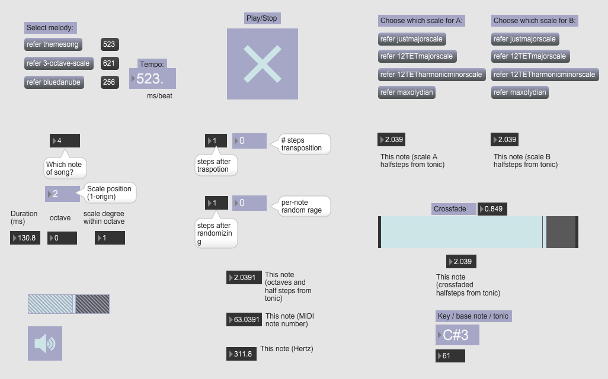

# Transporting

Crossfading between scales and check out Maxolydian!

**See video demo [here](https://youtu.be/kylDQCzgm40).**

-------

This project is an extension from the coursework in the [Programming Max: Structuring Interactive Software for Digital Arts](https://www.kadenze.com/courses/programming-max-structuring-interactive-software-for-digital-arts-i/info) course of Stanford University. A slider is set to control the crossfading between two scales which you can set by yourself. 

The new scale I brought up is what I call it "Maxolydian", with a sharp 4th and a flat 7th corresponding to the major scale. I named it because it is sort of like Mixolydian and I was playing around MAX then...

In the step transposition part, I limit the number range between -5 and 5, because in this patch when the note number which is passed through the scale collection reaches the maximum index of the collection, it just stays at that number which means the highest note within the scale.

And the same with the random part, where I limited the randomizing range between 0 and 7. 0 means no randomness.

Crossfading between scales is inspiring. If we regard the traditional modulation in music like key shifting, mode shifting as a "discrete" transform in aesthetic, then the crossfading of the different scales and keys expands it to a continuous form! This is cool.

-------

## Credits

* The patch is based on the original version by Matthew Wright: https://music.stanford.edu/people/matt-wright